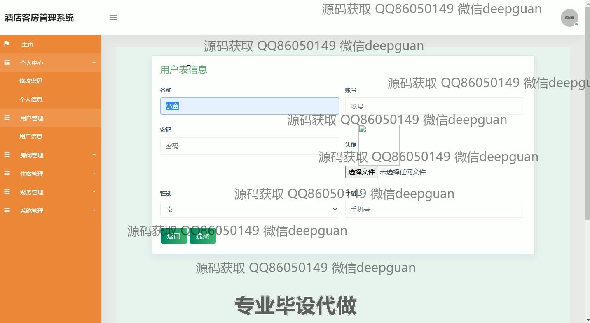
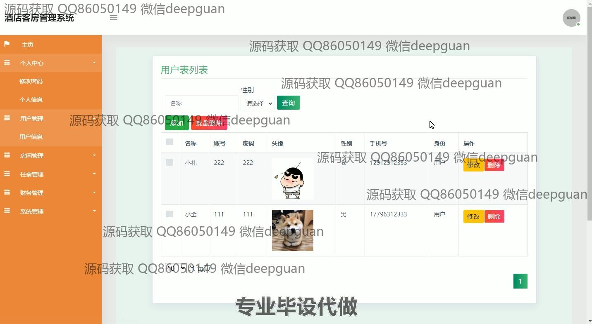
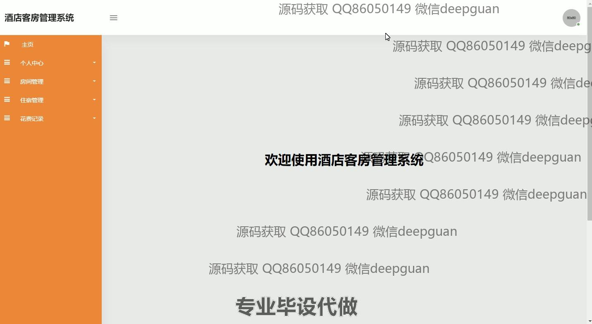
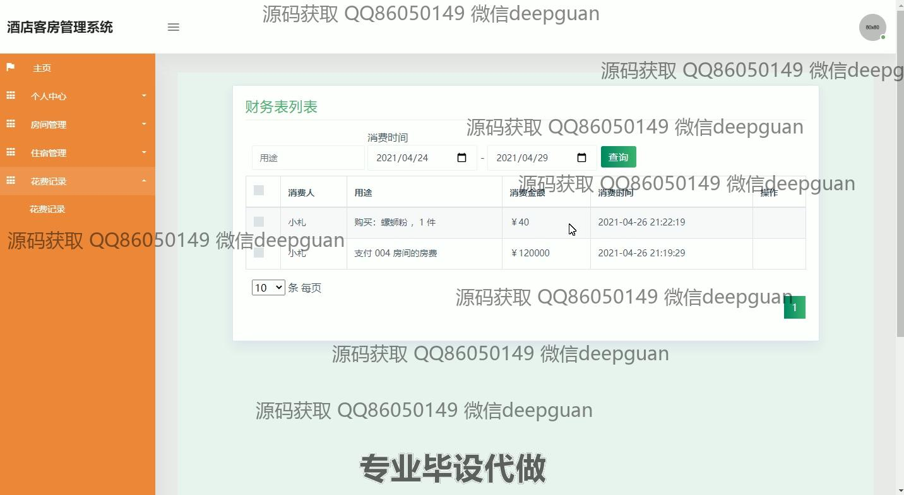

<h1 align="center">酒店客房管理系统</h1>

## 简介
酒店客房管理系统：角色分为管理员、用户；功能包括用户管理、房间管理、住宿管理、财务管理、个人中心、系统管理、房间展示与预定、商品管理以及消费记录查询。简单易用，支持高效管理。    --计算机毕业设计源码；毕设源码；java毕业设计源码

## 联系方式

<h3 align="center">获取完整代码与数据库文件 + 微信：deepguan QQ: 86050149 QQ群: 783742310</h3>

<h3 align="center">可帮忙远程部署 包运行成功！提供远程部署、修改代码、设计文档指导、代码讲解等服务！</h3>

## 功能介绍（完整见运行截图）
管理员：管理员可以访问系统的所有模块，包括用户管理,房间管理,住宿管理,财务管理和系统管理。可以编辑用户信息，查看与修改财务记录，管理房间及预定列表，以及查看和处理住宿信息。管理员可以通过左侧的导航菜单高效地跳转至不同模块。可使用系统提供的筛选和搜索功能来优化信息查询和处理流程。

前台工作人员：前台人员主要负责房间预定管理和入住管理。可以查看和编辑房间预定信息，使用系统更新客户的入住状态和日期。在入住管理中，他们能够合法修改住宿时间和状态信息。界面设计简便易用，帮助工作人员快捷核对和调整预定与入住信息。

财务人员：财务人员通过系统的财务管理模块，查看和管理消费和收入记录。他们能生成特定时间段的财务报表，删除或修改扩展记录。财务表包含详细的消费人、用途、金额及时间信息，使财务管理更加有序。

酒店顾客：酒店顾客可以使用系统查看房间信息，推荐房间以及搜索特定房间进行预约。通过个人中心，顾客可以修改个人信息，查询预定状况和历史记录。系统提供了一站式服务体验，使顾客能自主管理和查看自己的住宿需求。

## 运行截图

本代码来源于网络,仅供学习参考使用!

